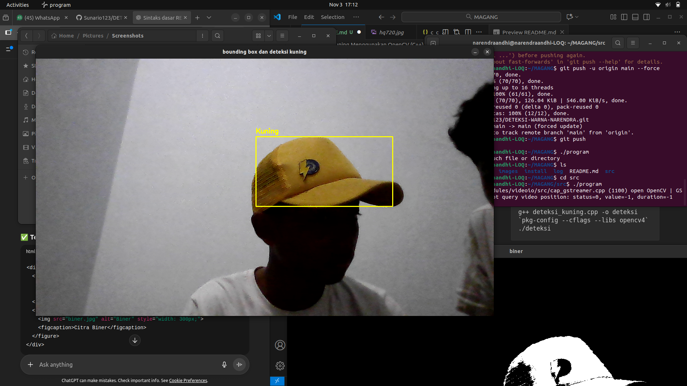

# Deteksi Warna Kuning Menggunakan OpenCV (C++)

Program ini dibuat untuk menyelesaikan penugasan tim RIVAL ITS. program ini dibuat untuk mendeteksi warna kuning pada objek menggunakan kamera laptop dan memberikan bounding box pada objek yang terdeteksi. Program ditulis dalam bahasa C++ dengan menggunakan library OpenCV.

---

## Identitas

| Keterangan | Data |
|----------|------|
| Nama | Narendra Andhi Putra Pratama|
| NRP | 5022251034 |
| Program Studi | Teknik Elektro |
| Keperluan | Penugasan RIVAL ITS |

---

## Fitur Program
- Deteksi warna kuning menggunakan ruang warna HSV
- Memberikan bounding box pada objek berwarna kuning (khususnya kuning topi)
- Menampilkan hasil deteksi secara real-time
- menampilkan warna yang diseleksi di frame biner

---

## Kode Program dan Penjelasan

### A. Import Library
Mengimpor library OpenCV dan I/O
```cpp
#include <opencv4/opencv2/opencv.hpp>
#include <iostream>
```

### B. Inisialisasi Kamera
Mengakses kamera default (index 0)
```cpp
cv::VideoCapture cam(0);
cv::Mat frame;
```

### C. Loop Utama (Real Timer Capture)
Membaca gambar secara terus menerus dari kamera
```cpp
while (true)
{
    cam >> frame;
    ...
```

### D. Konversi Warna dari BGR ke HSV
Ruang warna HSV lebih stabil untuk deteksi warna
```cpp
cv::Mat hsv;
cv::cvtColor(frame, hsv, cv::COLOR_BGR2HSV);
```

### E. Pengaturan Range Warna Kuning (HSV)
Menentukan batas atas dan batas bawah warna kuning
```cpp
cv::Scalar batasbawah(15/2, 100, 100);
cv::Scalar batastas(77/2, 255, 255);
```

### F. Treshold ke Citra Biner
Menghasilkan citra hitam-putih untuk warna kuning
```cpp
cv::Mat biner;
cv::inRange(hsv, batasbawah, batastas, biner);
```

### G. Deteksi Kontur
Untuk mencari batas objek yyang terdeteksi
```cpp
std::vector<std::vector<cv::Point>> contours;
cv::findContours(biner, contours, cv::RETR_EXTERNAL, cv::CHAIN_APPROX_SIMPLE);
```

### H. Menggambar Batas Warna (Bounding Box)
Hanya objek dengan luas area > 10.000 piksel yang dianggap valid
```cpp
for (auto &contour : contours) {
    double area = cv::contourArea(contour);
    if (area > 10000) {
        cv::Rect box = cv::boundingRect(contour);
        cv::Scalar warnaGaris(0, 255, 255); // kuning
        cv::rectangle(frame, box, warnaGaris, 2);
        cv::putText(frame, "Kuning", {box.x, box.y - 10},
                    cv::FONT_HERSHEY_SIMPLEX, 0.6, warnaGaris, 2);
    }
}
```

### I. Menampilkan Hasil
```cpp
cv::imshow("bounding box dan deteksi kuning", frame);
cv::imshow("biner", biner);
if(cv::waitKey(1) == 48){ // tekan '0' untuk exit
    break;
}
```

### Closing
```cpp
cam.release();
cv::destroyAllWindows();
return 0;
```

### Compile & Run 
Pakai perintah berikut untuk menjalankan program di atas

## Cara Compile & Run di Ubuntu

```bash
g++ deteksi_kuning.cpp -o deteksi `pkg-config --cflags --libs opencv4`
./deteksi
```

## Contoh Output
<p align="center">
  <br>
  <i>Gambar 1</i>
</p>

<p align="center">
  <br>
  <i>Gambar 2</i>
</p>

<p align="center">
  <br>
  <i>Gambar 3</i>
</p>


## Terimakasih 
